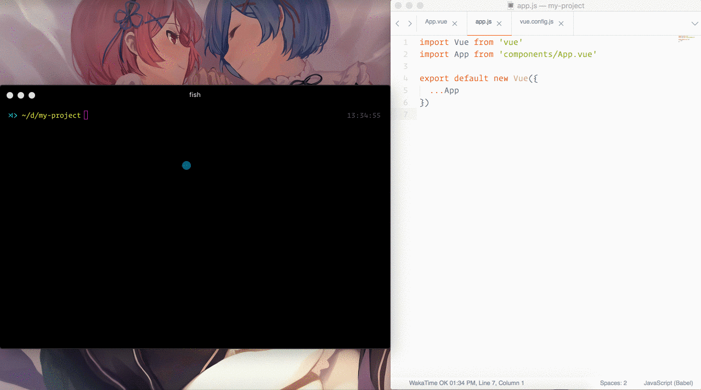

# vbuild

[](https://npmjs.com/package/vbuild) [](https://npmjs.com/package/vbuild) [](https://circleci.com/gh/egoist/vbuild)



## Philosophy

**Install once and build everywhere.**

`vbuild` is an opinionated but configurable build tool with lots of goodies included, it's inspired by [create-react-app](https://github.com/facebookincubator/create-react-app) and [xo](https://github.com/sindresorhus/xo). No webpack config and other tooling config to manage. It just works!

- [Getting Started](https://vbuild.js.org/docs/getting-started.html) - How to start developing an app **in seconds**
- [User Guide](https://vbuild.js.org/docs) - The vbuild handbook
- [How to use in non-Vue projects](https://vbuild.js.org/docs/non-vue-projects.html) - Gracefully adapted for developing React apps too!

## Quick Start

```bash
# recommend node.js >=6 and npm >= 3
npm install -g vbuild

vbuild init my-project
cd my-project
npm run dev
```

Then you will be automatically navigated to http://localhost:4000<br>
When you are ready to deploy your app, run `npm run build` to bundle.

## Showcase

[Let us know if you are using vbuild in production!](https://vbuild.js.org/docs/showcase.html)

## License

MIT © [EGOIST](https://github.com/egoist)
