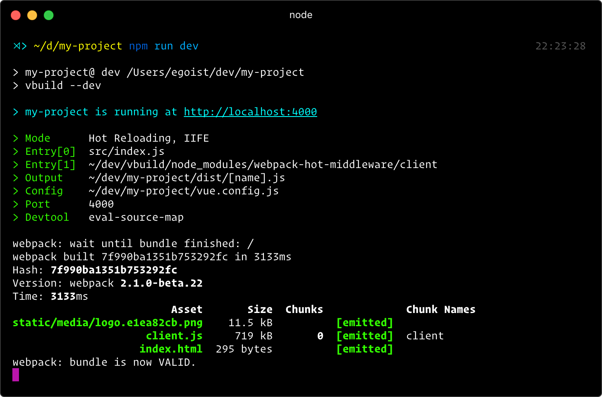

<h1 align="center">vbuild</h1>

<p align="center"><a href="https://npmjs.com/package/vbuild"></a> <a href="https://npmjs.com/package/vbuild"></a> <a href="https://circleci.com/gh/egoist/vbuild"></a></p>



## Philosophy

**Install once and build everywhere.**

`vbuild` is an opinionated but configurable build tool with lots of goodies included, it's inspired by [create-react-app](https://github.com/facebookincubator/create-react-app) and [xo](https://github.com/sindresorhus/xo). No webpack config and other tooling config to manage. It just works!

- [Getting Started](https://vbuild.js.org/docs/getting-started.html) - How to start developing an app **in seconds**
- [User Guide](https://vbuild.js.org/docs) - The vbuild handbook
- [How to use in non-Vue projects](https://vbuild.js.org/docs/non-vue-projects.html) - Gracefully adapted for developing React apps too!

## Quick Start

```bash
# recommend node.js >=6 and npm >= 3
yarn global add vbuild
# or npm i -g vbuild

vbuild init my-project
cd my-project
yarn
yarn dev
```

Then you can open http://localhost:4000<br>
When you are ready to deploy your app, run `npm run build` to bundle.

## Use Cases

- Build regular Vue web app
- Build server bundle for your app
- Build your components and directives
- Build electron app
- Build non-Vue web apps
- Build non-Vue commonjs/umd libraries
- ... use your imagination

## What’s Inside?

- Webpack 2.2.0-rc.3
- Babel
- PostCSS
- ESlint (optional)
- Karma (experimental)

## Showcase

[Let us know if you are using vbuild in production!](https://vbuild.js.org/docs/showcase.html)

## License

MIT © [EGOIST](https://github.com/egoist)
